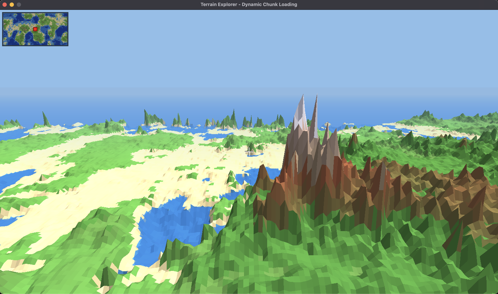

# 🌍 Terrain Explorer



A 3D terrain explorer with **dynamic chunk loading**, **jet flight physics**, and **destructible terrain**. Built with Python, Pygame, and OpenGL.

## ✨ Features

- 🗺️ **Dynamic Chunk Loading** - Terrain loads/unloads as you explore
- ✈️ **Jet Flight Mode** - Full 360° aerobatics, do loops and barrel rolls!
- 💥 **Destructible Terrain** - Fire projectiles to blast craters in the world
- 🧭 **Live Minimap** - See the whole world and your position in real-time
- 🌊 **Realistic Coloring** - Ocean depths, beaches, forests, mountains, snow peaks

## 🚀 Quick Start

```bash
# Create virtual environment
python3 -m venv venv
source venv/bin/activate

# Install dependencies
pip install -r requirements.txt

# Run the explorer
python terrain_explorer.py
```

## 🎮 Controls

### Movement (Left Stick)
| Key | Action |
|-----|--------|
| `W` / `↑` | Fly forward (in facing direction) |
| `S` / `↓` | Fly backward |
| `A` / `←` | Strafe left |
| `D` / `→` | Strafe right |
| `H` | Fly UP |
| `F` | Fly DOWN |
| `Alt` | Move faster |

### Camera (Right Stick)
| Key | Action |
|-----|--------|
| `I` | Pitch UP (hold to do loops!) |
| `K` | Pitch DOWN |
| `J` | Look LEFT |
| `L` | Look RIGHT |
| `Right-Click + Mouse` | Free look |

### Weapons
| Key | Action |
|-----|--------|
| `Space` | 🔥 Fire projectile |
| `Left-Click` | 🔥 Fire projectile (alt) |

*3 shots per second • Creates craters • Updates minimap in real-time*

### Other
| Key | Action |
|-----|--------|
| `ESC` | Exit |

## 💣 Destructible Terrain

Fire projectiles at the terrain to:
- **Blast craters** with realistic spherical shapes
- **Lower terrain** - reduce mountain heights
- **Create lakes** - blast below sea level to fill with water
- **See destruction on minimap** - updates live!

## 🗺️ How It Works

The explorer reads a raw NumPy heightmap file (`.npy`) with elevation data:

- **Negative values** → Ocean (deeper = darker blue)
- **~0** → Sea level / beaches
- **Positive values** → Land (green → brown → snow peaks)

Terrain is split into 64×64 chunks that load dynamically as you fly around, allowing exploration of massive worlds.

## ⚙️ Configuration

Adjust these values in `terrain_explorer.py`:

```python
CHUNK_SIZE = 64           # Size of each terrain chunk
CHUNK_RENDER_DISTANCE = 3 # How many chunks to render
HEIGHT_SCALE = 5.0        # Vertical exaggeration
TERRAIN_SCALE = 0.8       # Horizontal scale
EXPLOSION_RADIUS = 15     # Crater size
FIRE_RATE = 0.33          # Shots per second (3)
```

## 📁 Files

- `terrain_explorer.py` - Main application
- `raw_map_*.npy` - Raw heightmap data
- `requirements.txt` - Python dependencies
- `screenshot.png` - Preview image

## 🎯 Tips

- **Do a loop**: Hold `I` while flying forward with `W`
- **Strafe run**: Combine `A`/`D` with `J`/`L` for cinematic flight
- **Terraform**: Blast mountains flat or create new lakes!
- **Check minimap**: Red square shows your position on the full world map

---

Made with 🐍 Python + 🎮 Pygame + 🔺 OpenGL
